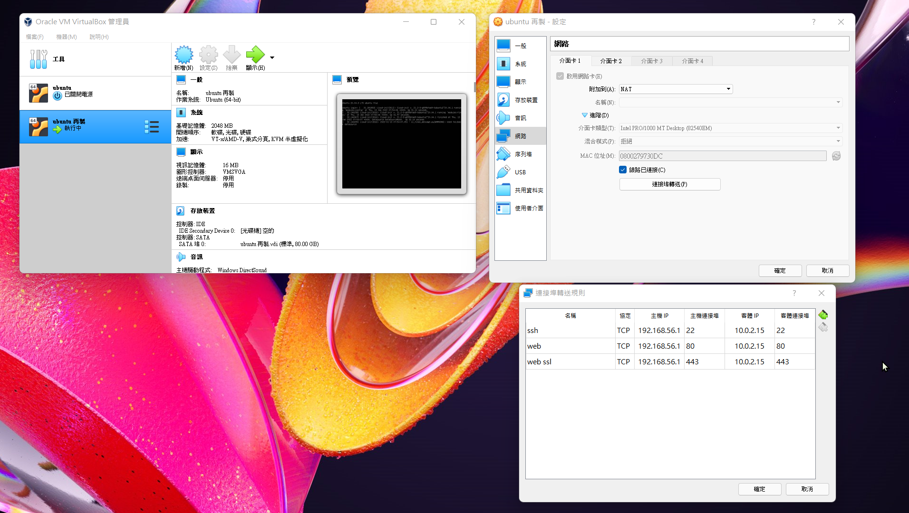
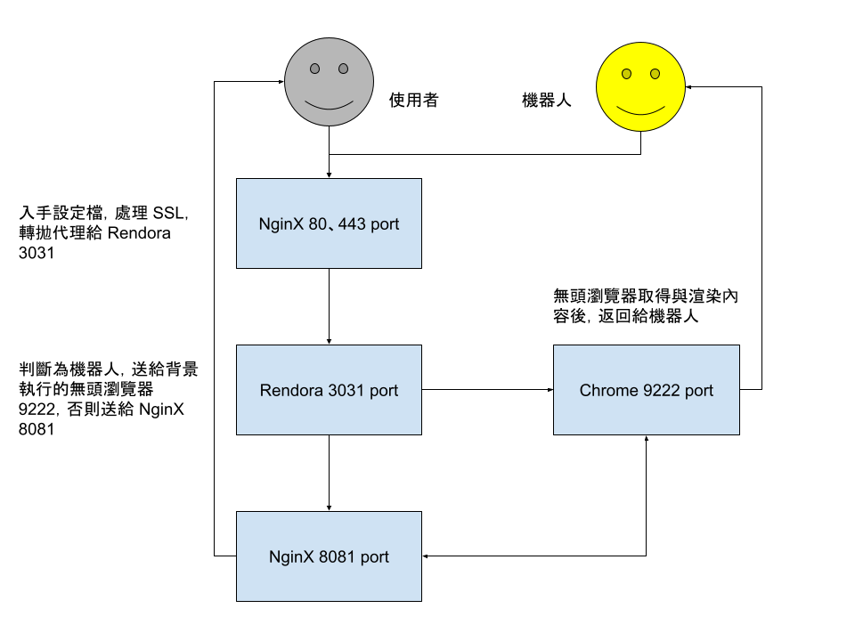

# 自動化架站腳本

### 以 sudo 權限執行
```bash
sudo sh ./ec2-new-buuntu.sh
```
### 腳本內有參數，請依照專案與環境修改

> 此腳本會安裝 LNMP 在 Ubuntu 上
> 
> 並設定資料庫使用者 + NginX 網站設定檔

> 如果在虛擬機測試記得不要開啟安裝免費 SSL 證書，
> 
> 會驗證不過

> 如果使用 RDS 不用安裝資料庫

> 附有 index.php 用以驗證架設成功
>
> 以 phpPgAdmin 連接 PostgreSQL (如果有在本機安裝)
> 
> 以 phpMyAdmin 連接 MariaDB (如果有在本機安裝)
>
> 以 phpRedisAdmin 連接 Redis (如果有在本機安裝)


### 本機測試用 VM 檔，完全乾淨的 Ubuntu
[https://drive.google.com/file/d/1GYLQZ2ffmPScvKXK_rle33_cmAV3fF_3/view?usp=sharing](https://drive.google.com/file/d/1GYLQZ2ffmPScvKXK_rle33_cmAV3fF_3/view?usp=sharing)
> 登入帳號：ubuntu
> 
> 登入密碼：ubuntu
> 
> root 密碼：ubuntu
> 
> host ip 192.168.56.1
> 
> vm ip 10.0.2.15
> 
> 轉 22、80、443 port

